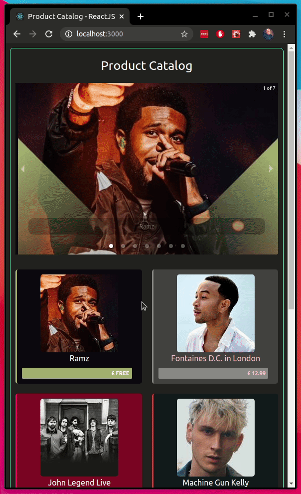

# ReactJS Product Catalog

A product catalog using react.js, create-react-app and javascript. Styles are per-react-component. Tests are stored within each component's folder.

## Screens



## Pre-requisites

- [node && npm (bundled with node)](https://nodejs.org/en/)
- Environment variable `ENDPOINT` set with base url of backend; a default is set in the `APIUtils.js` but it might not be up all the time. Sample responses are stored in the `APIUtilsSamples.js`.

## Available Scripts

Before anything, run:

```
npm install
```

In the project directory, you can run:

### Start

```
npm run start
```

Runs the app in the development mode.\
Open [http://localhost:3000](http://localhost:3000) to view it in the browser.

The page will reload if you make edits.\
You will also see any lint errors in the console.

### Test

```
npm run test
```

Launches the test runner in the interactive watch mode.\
See the section about [running tests](https://facebook.github.io/create-react-app/docs/running-tests) for more information.

### Build

```
npm run build
```

Builds the app for production to the `build` folder.\
It correctly bundles React in production mode and optimizes the build for the best performance.

The build is minified and the filenames include the hashes.\
The app is ready to be deployed!
